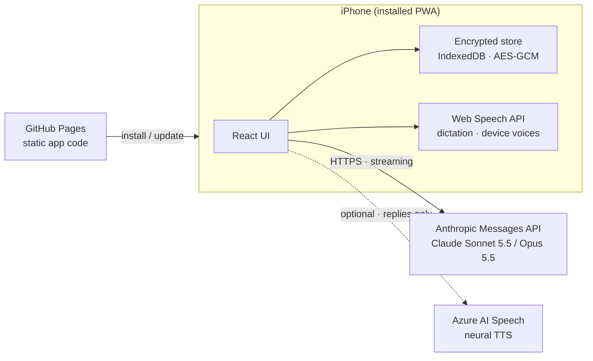

<div align="center">


# Seans

**A private, AI-assisted companion for reflective counseling sessions, built as an installable web app (PWA).**

**English** · [Türkçe](README.tr.md) · [Русский](README.ru.md)


</div>

> [!IMPORTANT]
> Seans is **not** a medical device and does **not** replace a licensed therapist or psychologist. It is a personal support tool for use between sessions. If you are in crisis or in danger, contact your local emergency number (112 in Europe and Türkiye) right away.

## What it is

Seans is a personal mobile app for structured, evidence-informed reflection. It runs a time-boxed counseling-style conversation with Anthropic's Claude, keeps a journal of difficult moments, and maintains a running case file with reports after each session. It is designed for **one person on one device**: there is no server, no account system and no shared database.

The project started as an experiment in turning a series of chat-based reflection sessions into a calm, phone-first experience that keeps continuity from one session to the next while keeping sensitive data on the device.

## Features

| Area | What it does |
|---|---|
| **Sessions** | 50-minute conversations with a clock that runs only while the screen is open. The counselor works from the case file, the latest report and recent journal entries, and paces itself to the remaining time. |
| **Post-session work** | After closing, the model drafts a session report, an updated case file and a map of the recurring pattern ("cycle"). Nothing is saved until the user reads, optionally edits and approves it. |
| **Journal** | A structured log for difficult moments: event, thought, emotions, intensity (0-10), behavior and what lay beneath. Entries are passed to the next session. |
| **Cycle map** | The recurring pattern shown step by step, with a healthier alternative at every step. |
| **Tools** | 4-7-8 breathing with an animated guide, a three-step self-compassion break (after Kristin Neff) and a "beneath the anger" exercise. |
| **Voice** | Dictation through the system keyboard or in-app speech recognition, read-aloud replies with device voices or optional Azure neural voices, and a hands-free mode. |
| **Safety** | An always-visible emergency button, crisis instructions in the counselor prompt, and a clear statement of the tool's limits. |
| **Languages** | Turkish and English for both the interface and the counselor. |
| **Cost visibility** | Token usage and an estimated cost are tracked and shown for every session. |

## Privacy and security

- **Local-first.** All data lives in the browser's IndexedDB on the device. The published site contains only application code, no personal data.
- **Encrypted at rest.** The whole data store is encrypted with AES-GCM (256-bit). The key is derived from a 6-digit PIN with PBKDF2-SHA-256 and 600,000 iterations, using a random salt and a fresh 12-byte IV on every write. Repeated wrong PINs trigger an increasing lockout, and the app locks itself after two minutes in the background.
- **Direct connections only.** During a session, messages go straight from the device to the Anthropic API. If Azure voices are enabled, only the counselor's replies are sent to Microsoft for speech synthesis. There is no intermediary server.
- **Bring your own keys.** API keys are entered on the device, stored inside the encrypted store and excluded from backups.
- **No recovery.** Without the PIN the data cannot be decrypted. The user can export JSON backups and Markdown copies; these files are not encrypted and should be stored with care.

> [!NOTE]
> A 6-digit PIN protects against casual access to the device. It is not designed to withstand a determined offline attack on an extracted copy of the data.

## Architecture



**Session flow.** At the start of a session a system prompt is assembled from fixed counseling rules, the case file, the latest report and recent journal entries, and it stays unchanged for the whole session. Each user turn carries the remaining time, and the conversation history is replayed byte-for-byte so that prompt caching keeps the cost of long sessions low. When the session closes, a separate request returns the report, the updated case file and the cycle as tagged sections, which the app parses and shows for review.

## Tech stack

| Layer | Technology | Version |
|---|---|---|
| UI | React | 19.3 |
| Language | TypeScript | 6.0 |
| Build | Vite | 8.3 |
| Styling | Tailwind CSS (Vite plugin) | 4.3 |
| Motion | Motion (`motion/react`) | 14.0 |
| Icons | Phosphor Icons | 2.1 |
| Typeface | Geist Variable (self-hosted via Fontsource) | 5.3 |
| PWA | vite-plugin-pwa (Workbox) | 2.0 |
| AI | Anthropic TypeScript SDK (`@anthropic-ai/sdk`) | 0.131 |
| Storage | idb-keyval (IndexedDB) | 6.3 |
| Encryption | Web Crypto API (PBKDF2, AES-GCM) | Browser built-in |
| Markdown | marked + DOMPurify | 18.0 / 3.4 |
| Speech | Web Speech API, Azure AI Speech REST (optional) | Browser built-in / v1 |
| Lint | oxlint | 1.86 |
| Runtime for builds | Node.js | 24 |
| Hosting | GitHub Pages via GitHub Actions | |

**AI configuration.** Claude Sonnet 5.5 by default, with Claude Opus 5.5 selectable. Requests stream, use adaptive thinking at medium effort, enable automatic prompt caching and opt into server-side refusal fallbacks.

## Project structure

```
src/
├── App.tsx               App shell, lock and onboarding gates, navigation stack
├── components/           UI primitives, PIN pad, tab bar, emergency sheet, mic button
├── screens/              Home, sessions, chat, review, journal, files, tools, settings
│   └── sessionLogic.ts   Session lifecycle: start, send, close, report, approve
└── lib/
    ├── claude.ts         Anthropic client, streaming, cost accounting, error mapping
    ├── prompts.ts        Counselor rules and report instructions (TR / EN)
    ├── crypto.ts         PBKDF2 key derivation and AES-GCM sealing
    ├── store.ts          Encrypted vault, autosave, lockout
    ├── i18n.ts           Typed dictionary for Turkish and English
    ├── speech.ts         Dictation with watchdog, device voices
    ├── voice.ts          Read-aloud engine (device / Azure) with fallback
    └── files.ts          Markdown import / export, backups
```

## Getting started

Requirements: Node.js 24 or later.

```bash
npm install
npm run dev      # development server
npm run build    # type-check and production build into dist/
```

Web Crypto requires a secure context, so test on `localhost` or over HTTPS. To use the app you need your own [Anthropic API key](https://console.anthropic.com). Azure voices are optional and need an Azure AI Speech resource key and region.

## Deployment

Every push to `main` builds the app and publishes it to GitHub Pages through `.github/workflows/deploy.yml`. The build reads `BASE=/<repository-name>/` so assets resolve under the Pages sub-path. On iPhone, open the site in Safari and choose **Share > Add to Home Screen**. Updates are picked up automatically the next time the app starts.

## Limitations

- Safari's in-app speech recognition is unreliable in iPhone Home Screen mode, so keyboard dictation is the default there.
- Data is tied to one browser profile on one device. Removing the Home Screen app also removes its data, so regular backups matter.
- Model output can be wrong. Reports are drafts for the user to review, not clinical documents.

## License

Released under the [MIT License](LICENSE). Copyright (c) 2026 Yıldırım Öztürk.

The software is provided "as is", without warranty of any kind. It is not a medical device, and anyone who deploys or adapts it is responsible for how it is used.
