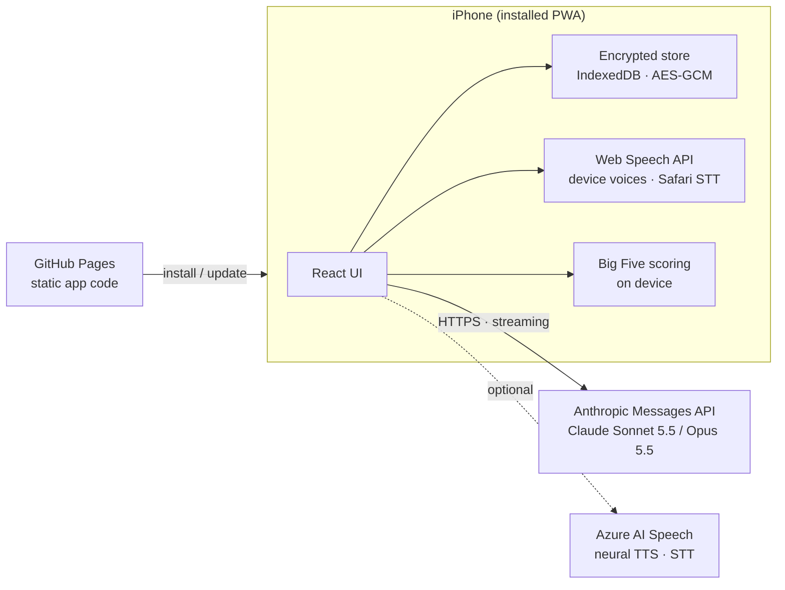

<div align="center">


# İçgörü

**A private, AI-assisted companion for reflective counseling sessions, built as an installable web app (PWA).**

*İçgörü is Turkish for "insight".*

**English** · [Türkçe](README.tr.md) · [Русский](README.ru.md)


</div>

> [!IMPORTANT]
> İçgörü is **not** a medical device and does **not** replace a licensed therapist or psychologist. It is a personal support tool for use between sessions. If you are in crisis or in danger, contact your local emergency number (112 in Europe and Türkiye) right away.

## What it is

İçgörü is a personal mobile app for structured, evidence-informed reflection. It runs a time-boxed counseling-style conversation with Anthropic's Claude, offers a library of research-backed self-help tools that the AI counselor tailors to each person, keeps a journal, and maintains a running case file with reports after each session. It is designed for **one person on one device**: there is no server, no account system and no shared database.

The project started as an experiment in turning a series of chat-based reflection sessions into a calm, phone-first experience that keeps continuity from one session to the next while keeping sensitive data on the device.

## What's new in 2.0

Version 2.0 grew out of a real user's feedback after a session, and out of the goal of making the app useful to anyone rather than to a single scenario.

**The counselor got better at counseling.** The feedback named four problems, and each now has a rule in the counselor's instructions:

| Feedback | Change |
|---|---|
| It agreed too much and followed the client instead of leading. | The counselor sets a focus for each session, balances validation with gentle challenge, and takes the lead when asked. |
| A practical topic took over part of the session. | Drifting away from an emotional point into technical or intellectual topics is treated as possible avoidance: the counselor names it early and returns to the focus. |
| It reacted with yes or no and changed its hypothesis too quickly. | Hypotheses are held with reasons, updated only on evidence, and every change is explained. Open questions are preferred over yes/no. |
| Dictation errors changed the meaning of what was said. | The counselor is told that input may come from speech-to-text and asks instead of building on a misheard word. Optional Azure speech recognition was added for much more accurate transcription. |

**From one person's tools to everyone's tools.** Version 1 had exercises named after one person's situation. In 2.0 these are universal, research-backed templates (thought record, primary and secondary emotions, self-compassion, paced breathing, grounding, cognitive restructuring, values, assertive communication, urge surfing). The **AI counselor, not the user, decides** which tools to feature, what to call them and which options they show, so the same template becomes "Moment before the outburst" for one person and "Anxiety log" for another. The counselor can only choose from validated parameters, never invent new screens, and every change is shown for approval in the session review.

**Personality test for new users.** People who start without a case file can take a short Big Five test (the 20-item, public-domain Mini-IPIP) presented in a friendly, card-based format. Scoring happens on the device. The result and a few "what brings you here" choices let the counselor prepare an initial case file and tools in a single request.

**Low cost by design.** Tool updates ride along with the end-of-session report request, so they add almost nothing. Personalizing a new user takes one request of a few cents. Test scoring is local.

**New name.** The app was renamed from "Seans" (session) to **İçgörü** (insight), because it is now more than a session screen.

## Features

| Area | What it does |
|---|---|
| **Sessions** | 50-minute conversations with a clock that runs only while the screen is open. The counselor works from the case file, the latest report, journal and tool entries and the personality profile, and paces itself to the remaining time. |
| **Post-session work** | After closing, the model drafts a session report, an updated case file, a map of the recurring pattern ("cycle") and any tool changes. Nothing is saved until the user reads, optionally edits and approves it. |
| **Tool library** | Nine evidence-based tools. The counselor features up to five on the home screen, names them in the client's own words and explains why each fits. |
| **Personality test** | Mini-IPIP Big Five with a named result card and trait descriptions. Optional, retakable, scored on the device. |
| **Journal** | Structured moment logs plus saved tool results (thought checks, scripts, values, urges). Entries are passed to the next session. |
| **Voice** | Three speech-to-text options (system keyboard, Safari, Azure), read-aloud with device voices or Azure neural voices, and a hands-free mode. |
| **Safety** | An always-visible emergency button, crisis instructions in the counselor prompt, and a clear statement of the tool's limits. |
| **Languages** | Turkish and English for both the interface and the counselor. |
| **Cost visibility** | Token usage and an estimated cost are tracked and shown for every session. |

### Tool templates

| Template | Based on | What the counselor can set |
|---|---|---|
| Moment log | CBT thought record | Name, emotion list, the question about the deeper feeling |
| Beneath the feeling | Primary vs. secondary emotions (EFT) | Surface emotion, list of deeper feelings |
| Self-compassion break | Neff's three steps | A kind sentence for the client's inner critic |
| Breathing | Paced breathing | 4-7-8, box, physiological sigh or coherent breathing |
| Grounding | 5-4-3-2-1 senses | Name |
| Thought check | Cognitive restructuring | Name |
| Values compass | Acceptance and Commitment Therapy | Relevant values |
| Say it clearly | DBT DEAR MAN | Name |
| Urge surfing | Mindfulness-based relapse prevention | What the urge is, duration |

## Privacy and security

- **Local-first.** All data lives in the browser's IndexedDB on the device. The published site contains only application code, no personal data.
- **Encrypted at rest.** The whole data store is encrypted with AES-GCM (256-bit). The key is derived from a 6-digit PIN with PBKDF2-SHA-256 and 600,000 iterations, using a random salt and a fresh 12-byte IV on every write. Repeated wrong PINs trigger an increasing lockout, and the app locks itself after two minutes in the background.
- **Direct connections only.** During a session, messages go straight from the device to the Anthropic API. There is no intermediary server.
- **Microsoft only when chosen.** If Azure is chosen for read-aloud, the counselor's replies are sent to Microsoft. If Azure is chosen for speech recognition, the user's voice is sent to Microsoft. With the other options nothing goes to Microsoft.
- **Bring your own keys.** API keys are entered on the device, stored inside the encrypted store and excluded from backups.
- **No recovery.** Without the PIN the data cannot be decrypted. The user can export JSON backups and Markdown copies; these files are not encrypted and should be stored with care.

> [!NOTE]
> A 6-digit PIN protects against casual access to the device. It is not designed to withstand a determined offline attack on an extracted copy of the data.

## Architecture



**Session flow.** At the start of a session a system prompt is assembled from fixed counseling rules, the case file, the latest report, recent journal and tool entries, the client's tools and the personality profile, and it stays unchanged for the whole session. Each user turn carries the remaining time, and the conversation history is replayed byte-for-byte so that prompt caching keeps the cost of long sessions low. When the session closes, a separate request returns the report, the updated case file, the cycle and a tool patch as tagged sections, which the app parses, validates and shows for review.

**How tool personalization stays safe.** The counselor answers with a small JSON patch. The app accepts only known tool kinds and parameters, caps text lengths and list sizes, merges the patch into the current settings and falls back to built-in defaults for anything missing or invalid. "No change" is a single word, so unchanged sessions cost nothing extra.

## Tech stack

| Layer | Technology | Version |
|---|---|---|
| UI | React | 19.3 |
| Language | TypeScript | 6.0 |
| Build | Vite | 8.3 |
| Styling | Tailwind CSS (Vite plugin) | 4.3 |
| Motion | Motion (`motion/react`) | 14.0 |
| Icons | Phosphor Icons | 2.1 |
| Typeface | Geist Variable (self-hosted via Fontsource) | 5.3 |
| PWA | vite-plugin-pwa (Workbox) | 2.0 |
| AI | Anthropic TypeScript SDK (`@anthropic-ai/sdk`) | 0.131 |
| Storage | idb-keyval (IndexedDB) | 6.3 |
| Encryption | Web Crypto API (PBKDF2, AES-GCM) | Browser built-in |
| Markdown | marked + DOMPurify | 18.0 / 3.4 |
| Speech | Web Speech API; Azure AI Speech REST for TTS and short-audio STT (optional) | Browser built-in / v1 |
| Audio capture | getUserMedia + Web Audio, 16 kHz PCM WAV encoding | Browser built-in |
| Personality | Mini-IPIP, 20 items (Donnellan et al., 2006), IPIP public domain | |
| Lint | oxlint | 1.86 |
| Runtime for builds | Node.js | 24 |
| Hosting | GitHub Pages via GitHub Actions | |

**AI configuration.** Claude Sonnet 5.5 by default, with Claude Opus 5.5 selectable. Requests stream, use adaptive thinking at medium effort, enable automatic prompt caching and opt into server-side refusal fallbacks.

## Project structure

```
src/
├── App.tsx               App shell, lock and onboarding gates, navigation stack
├── components/           UI primitives, PIN pad, tab bar, emergency sheet, mic button, text field
├── screens/
│   ├── Home.tsx          Bento home built from the counselor's featured tools
│   ├── Tools.tsx         Tool library and the nine tool screens
│   ├── Personality.tsx   Big Five test, concerns, result card
│   ├── SessionChat.tsx   Session conversation with voice input and read-aloud
│   ├── Review.tsx        Report, case file, cycle and tool changes for approval
│   └── sessionLogic.ts   Session lifecycle, reports, personalization
└── lib/
    ├── claude.ts         Anthropic client, streaming, cost accounting, error mapping
    ├── prompts.ts        Counselor rules, report and personalization instructions (TR / EN)
    ├── tools.ts          Tool templates, defaults, validation and merging of counselor patches
    ├── personality.ts    Mini-IPIP items, scoring, archetype names, trait texts
    ├── crypto.ts         PBKDF2 key derivation and AES-GCM sealing
    ├── store.ts          Encrypted vault, autosave, lockout
    ├── i18n.ts           Typed dictionary for Turkish and English
    ├── dictation.ts      Chooses the speech-to-text engine from settings
    ├── speech.ts         Safari speech recognition with watchdog, device voices
    ├── stt.ts            Azure speech-to-text: recording, WAV encoding, chunking
    ├── voice.ts          Read-aloud engine (device / Azure) with fallback
    └── files.ts          Markdown import / export, backups
```

## Getting started

Requirements: Node.js 24 or later.

```bash
npm install
npm run dev      # development server
npm run build    # type-check and production build into dist/
```

Web Crypto requires a secure context, so test on `localhost` or over HTTPS. To use the app you need your own [Anthropic API key](https://console.anthropic.com). Azure voices and Azure speech recognition are optional and need an Azure AI Speech resource key and region.

## Deployment

Every push to `main` builds the app and publishes it to GitHub Pages through `.github/workflows/deploy.yml`. The build reads `BASE=/<repository-name>/` so assets resolve under the Pages sub-path. On iPhone, open the site in Safari and choose **Share > Add to Home Screen**. Updates are picked up automatically the next time the app starts.

## Limitations

- Safari's in-app speech recognition is unreliable in iPhone Home Screen mode, so keyboard dictation is the default there. Azure speech recognition works in that mode.
- The Turkish wording of the personality test is the project's own translation, not a validated adaptation. The test gives a light hint, not a clinical assessment.
- Data is tied to one browser profile on one device. Removing the Home Screen app also removes its data, so regular backups matter.
- Model output can be wrong. Reports and tool suggestions are drafts for the user to review, not clinical documents.

## License

Released under the [MIT License](LICENSE). Copyright (c) 2026 Yıldırım Öztürk.

The software is provided "as is", without warranty of any kind. It is not a medical device, and anyone who deploys or adapts it is responsible for how it is used.
