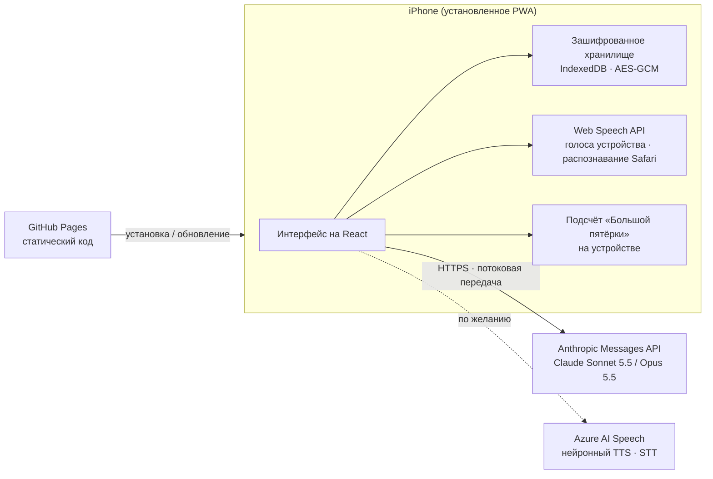

<div align="center">


# İçgörü

**Личный помощник для рефлексивных консультационных сессий с поддержкой ИИ, реализованный как устанавливаемое веб-приложение (PWA).**

*İçgörü по-турецки означает «инсайт», «понимание».*

[English](README.md) · [Türkçe](README.tr.md) · **Русский**


</div>

> [!IMPORTANT]
> İçgörü **не является** медицинским изделием и **не заменяет** лицензированного психотерапевта или психолога. Это личный инструмент поддержки между сессиями. В кризисной или опасной ситуации немедленно звоните по местному номеру экстренных служб (112 в Европе и Турции).

## Что это

İçgörü — личное мобильное приложение для структурированной рефлексии с опорой на доказательные подходы. Оно ведёт ограниченный по времени разговор в формате консультации с моделью Claude от Anthropic, предлагает библиотеку проверенных исследованиями инструментов самопомощи, которые ИИ-консультант подстраивает под каждого человека, ведёт дневник и поддерживает карту клиента, обновляемую отчётами после каждой сессии. Приложение рассчитано на **одного человека и одно устройство**: у него нет сервера, системы учётных записей и общей базы данных.

Проект начался как попытка превратить серию рефлексивных сессий в чате в спокойный, ориентированный на телефон опыт, который сохраняет преемственность между сессиями и при этом держит чувствительные данные на устройстве.

## Что нового в версии 2.0

> Все обновления с описанием того, что и зачем изменилось, перечислены в [CHANGELOG.md](CHANGELOG.md).

Версия 2.0 выросла из отзыва реального пользователя после сессии и из цели сделать приложение полезным для любого человека, а не для одного сценария.

**Консультант стал лучше консультировать.** Отзыв назвал четыре проблемы, и для каждой теперь есть правило в инструкциях консультанта:

| Отзыв | Изменение |
|---|---|
| Слишком часто соглашался и следовал за клиентом вместо того, чтобы вести. | Консультант задаёт фокус каждой сессии, уравновешивает поддержку мягким сомнением и берёт ведение на себя, когда его просят. |
| Практическая тема заняла часть сессии. | Уход от эмоциональной точки в технические или интеллектуальные темы рассматривается как возможное избегание: консультант рано замечает это, называет и возвращается к фокусу. |
| Реагировал «да» или «нет» и слишком быстро менял гипотезу. | Гипотезы удерживаются с обоснованием, меняются только на основании данных, и каждое изменение объясняется. Открытые вопросы предпочтительнее закрытых. |
| Ошибки диктовки меняли смысл сказанного. | Консультанту сообщается, что текст может быть получен распознаванием речи, и вместо того чтобы строить выводы на неверно услышанном слове, он переспрашивает. Добавлено необязательное распознавание речи Azure для гораздо более точной расшифровки. |

**От инструментов одного человека к инструментам для всех.** В версии 1 упражнения были названы под ситуацию одного человека. В 2.0 это универсальные, подкреплённые исследованиями шаблоны: дневник мыслей, первичные и вторичные эмоции, самосострадание, ритмичное дыхание, заземление, когнитивная реструктуризация, ценности, ассертивная коммуникация и «сёрфинг на волне желания». Какие инструменты выделить, как их назвать и какие варианты в них показать, **решает ИИ-консультант, а не пользователь**: один и тот же шаблон для одного человека становится «Моментом перед вспышкой», а для другого — «Дневником тревоги». Консультант выбирает только из проверенных параметров и не может придумывать новые экраны, а каждое изменение показывается на подтверждение при проверке сессии.

**Тест личности для новых пользователей.** Те, кто начинает без карты клиента, могут пройти короткий тест «Большой пятёрки» (20 вопросов, общедоступная шкала Mini-IPIP) в простом карточном интерфейсе. Подсчёт выполняется на устройстве. Результат и несколько ответов на вопрос «что привело вас сюда» позволяют консультанту одним запросом подготовить начальную карту клиента и инструменты.

**Низкая стоимость по замыслу.** Обновления инструментов передаются вместе с запросом отчёта в конце сессии и почти ничего не добавляют к стоимости. Персонализация нового пользователя — один запрос стоимостью в несколько центов. Тест подсчитывается локально.

**Новое название.** Приложение переименовано из «Seans» (сессия) в **İçgörü** (инсайт), потому что теперь это больше, чем экран сессии.

## Возможности

| Раздел | Что делает |
|---|---|
| **Сессии** | Беседы по 50 минут. Таймер идёт только пока экран открыт. Консультант опирается на карту клиента, последний отчёт, записи дневника и инструментов и профиль личности и распределяет темп по оставшемуся времени. |
| **Работа после сессии** | После завершения модель готовит черновики отчёта, обновлённой карты клиента, схемы повторяющегося паттерна («цикла») и изменений инструментов. Ничего не сохраняется, пока пользователь не прочитает, при желании не отредактирует и не подтвердит. |
| **Библиотека инструментов** | Девять доказательных инструментов. Консультант выносит до пяти на главный экран, называет их словами клиента и объясняет, почему каждый подходит. |
| **Тест личности** | «Большая пятёрка» Mini-IPIP с именной карточкой результата и описаниями черт. Необязательный, можно пройти повторно, подсчёт на устройстве. |
| **Дневник** | Структурированные записи трудных моментов и сохранённые результаты инструментов (проверки мыслей, сценарии разговоров, ценности, импульсы). Записи передаются в следующую сессию. |
| **Голос** | Три варианта распознавания речи (клавиатура, Safari, Azure), озвучивание голосами устройства или нейронными голосами Azure, режим «без рук». |
| **Безопасность** | Постоянно доступная кнопка экстренной помощи, кризисные инструкции в промпте консультанта и ясное описание границ инструмента. |
| **Языки** | Турецкий и английский — и для интерфейса, и для консультанта. |
| **Прозрачность затрат** | Для каждой сессии учитывается расход токенов и показывается примерная стоимость. |

### Шаблоны инструментов

| Шаблон | Основа | Что может настроить консультант |
|---|---|---|
| Дневник момента | Дневник мыслей КПТ | Название, список эмоций, вопрос о более глубоком чувстве |
| Под чувством | Первичные и вторичные эмоции (EFT) | Поверхностная эмоция, список глубинных чувств |
| Пауза самосострадания | Три шага Кристин Нефф | Доброе предложение против внутреннего критика |
| Дыхание | Ритмичное дыхание | 4-7-8, квадратное, физиологический вздох или когерентное дыхание |
| Заземление | Техника 5-4-3-2-1 | Название |
| Проверка мысли | Когнитивная реструктуризация | Название |
| Компас ценностей | Терапия принятия и ответственности | Подходящие ценности |
| Сказать ясно | DBT DEAR MAN | Название |
| Сёрфинг на волне желания | Профилактика срывов на основе осознанности | Что за импульс, длительность |

## Конфиденциальность и безопасность

- **Данные на устройстве.** Все данные хранятся в IndexedDB браузера на устройстве. Опубликованный сайт содержит только код приложения, без личных данных.
- **Шифрование хранилища.** Всё хранилище шифруется AES-GCM (256 бит). Ключ выводится из 6-значного PIN-кода через PBKDF2-SHA-256 с 600 000 итераций, со случайной солью и новым 12-байтовым IV при каждой записи. Повторные неверные PIN-коды включают нарастающую блокировку, а через две минуты в фоне приложение блокируется само.
- **Только прямые соединения.** Во время сессии сообщения уходят с устройства напрямую в Anthropic API. Промежуточного сервера нет.
- **Microsoft — только по выбору.** Если для озвучивания выбран Azure, в Microsoft отправляются ответы консультанта. Если Azure выбран для распознавания речи, туда отправляется голос пользователя. При других вариантах в Microsoft ничего не уходит.
- **Собственные ключи.** API-ключи вводятся на устройстве, хранятся в зашифрованном хранилище и не попадают в резервные копии.
- **Без восстановления.** Без PIN-кода данные расшифровать нельзя. Пользователь может экспортировать резервные копии в JSON и копии в Markdown; эти файлы не зашифрованы и требуют бережного хранения.

> [!NOTE]
> 6-значный PIN защищает от случайного доступа к устройству. Он не рассчитан на целенаправленную офлайн-атаку на извлечённую копию данных.

## Архитектура



**Ход сессии.** В начале сессии системный промпт собирается из фиксированных правил консультирования, карты клиента, последнего отчёта, свежих записей дневника и инструментов, списка инструментов клиента и профиля личности и остаётся неизменным до конца сессии. Каждое сообщение пользователя несёт оставшееся время, а история диалога повторно отправляется побайтово без изменений, чтобы кэширование промптов удерживало стоимость длинных сессий на низком уровне. После завершения отдельный запрос возвращает отчёт, обновлённую карту клиента, цикл и изменения инструментов в размеченных разделах, которые приложение разбирает, проверяет и показывает на подтверждение.

**Почему персонализация инструментов безопасна.** Консультант отвечает небольшим JSON-патчем. Приложение принимает только известные типы инструментов и параметры, ограничивает длину текстов и размер списков, накладывает патч на текущие настройки и для всего отсутствующего или некорректного возвращается к встроенным значениям. «Без изменений» — это одно слово, поэтому сессии без изменений ничего не стоят дополнительно.

## Технологии

| Слой | Технология | Версия |
|---|---|---|
| Интерфейс | React | 19.3 |
| Язык | TypeScript | 6.0 |
| Сборка | Vite | 8.3 |
| Стили | Tailwind CSS (плагин Vite) | 4.3 |
| Анимация | Motion (`motion/react`) | 14.0 |
| Иконки | Phosphor Icons | 2.1 |
| Шрифт | Geist Variable (локально через Fontsource) | 5.3 |
| PWA | vite-plugin-pwa (Workbox) | 2.0 |
| ИИ | Anthropic TypeScript SDK (`@anthropic-ai/sdk`) | 0.131 |
| Хранилище | idb-keyval (IndexedDB) | 6.3 |
| Шифрование | Web Crypto API (PBKDF2, AES-GCM) | Встроено в браузер |
| Markdown | marked + DOMPurify | 18.0 / 3.4 |
| Речь | Web Speech API; Azure AI Speech REST для TTS и распознавания коротких записей (по желанию) | Встроено в браузер / v1 |
| Запись звука | getUserMedia + Web Audio, кодирование PCM WAV 16 кГц | Встроено в браузер |
| Личность | Mini-IPIP, 20 пунктов (Donnellan et al., 2006), IPIP в общественном достоянии | |
| Линтер | oxlint | 1.86 |
| Среда сборки | Node.js | 24 |
| Хостинг | GitHub Pages через GitHub Actions | |

**Настройка ИИ.** По умолчанию используется Claude Sonnet 5.5, доступен выбор Claude Opus 5.5. Запросы идут потоком, используют адаптивное мышление со средним уровнем усилий, автоматическое кэширование промптов и серверный резервный переход при отказе модели (refusal fallback).

## Структура проекта

```
src/
├── App.tsx               Оболочка приложения, блокировка и онбординг, стек навигации
├── components/           Базовые элементы UI, PIN-клавиатура, панель вкладок, экстренная помощь, микрофон, поле ввода
├── screens/
│   ├── Home.tsx          Главный экран из инструментов, выбранных консультантом
│   ├── Tools.tsx         Библиотека и девять экранов инструментов
│   ├── Personality.tsx   Тест «Большой пятёрки», причины обращения, карточка результата
│   ├── SessionChat.tsx   Экран сессии с голосовым вводом и озвучиванием
│   ├── Review.tsx        Отчёт, карта клиента, цикл и изменения инструментов на подтверждение
│   └── sessionLogic.ts   Жизненный цикл сессии, отчёты, персонализация
└── lib/
    ├── claude.ts         Клиент Anthropic, потоковая передача, учёт стоимости, обработка ошибок
    ├── prompts.ts        Правила консультанта, инструкции к отчёту и персонализации (TR / EN)
    ├── tools.ts          Шаблоны инструментов, значения по умолчанию, проверка и слияние патчей
    ├── personality.ts    Пункты Mini-IPIP, подсчёт, названия профилей, описания черт
    ├── crypto.ts         Вывод ключа PBKDF2 и шифрование AES-GCM
    ├── store.ts          Зашифрованное хранилище, автосохранение, блокировка попыток
    ├── i18n.ts           Типизированный словарь для турецкого и английского
    ├── dictation.ts      Выбор движка распознавания речи по настройкам
    ├── speech.ts         Распознавание Safari со сторожевым таймером, голоса устройства
    ├── stt.ts            Распознавание Azure: запись, кодирование WAV, разбиение на части
    ├── voice.ts          Движок озвучивания (устройство / Azure) с запасным вариантом
    └── files.ts          Импорт / экспорт Markdown, резервные копии
```

## Быстрый старт

Требуется Node.js 24 или новее.

```bash
npm install
npm run dev      # сервер разработки
npm run build    # проверка типов и production-сборка в dist/
```

Web Crypto работает только в защищённом контексте, поэтому тестируйте на `localhost` или по HTTPS. Для работы приложения нужен собственный [ключ Anthropic API](https://console.anthropic.com). Голоса и распознавание речи Azure не обязательны; для них нужны ключ и регион ресурса Azure AI Speech.

## Развёртывание

Каждый push в ветку `main` собирает приложение и публикует его на GitHub Pages через `.github/workflows/deploy.yml`. Сборка использует `BASE=/<имя-репозитория>/`, чтобы ресурсы находились по подпути Pages. На iPhone откройте сайт в Safari и выберите **Поделиться > На экран «Домой»**. Обновления подхватываются автоматически при следующем запуске.

## Ограничения

- Встроенное распознавание речи Safari ненадёжно в режиме приложения на экране «Домой» iPhone, поэтому там по умолчанию используется диктовка с клавиатуры. Распознавание Azure работает и в этом режиме.
- Турецкие формулировки теста личности — собственный перевод проекта, а не валидированная адаптация. Тест даёт лёгкую подсказку, а не клиническую оценку.
- Данные привязаны к одному профилю браузера на одном устройстве. Удаление приложения с экрана «Домой» удаляет и его данные, поэтому важно регулярно делать резервные копии.
- Ответы модели могут содержать ошибки. Отчёты и предложения инструментов — это черновики для проверки пользователем, а не клинические документы.

## Приложения-компаньоны

| Приложение | Что делает |
|---|---|
| [**Akşam Notu**](https://github.com/YILDIRIMZX/aksam-notu) | Маленькая вечерняя заметка, выросшая из задания между сессиями: три необязательные строки перед сном (нерешённая проблема, первый шаг завтра, сработал ли будильник). Когда вечером выключается компьютер или не позже 22:00, на телефон приходит одно напоминание в день. Отдельный репозиторий, тот же стиль. |

## Лицензия

Распространяется по [лицензии MIT](LICENSE). Copyright (c) 2026 Yıldırım Öztürk.

Программа предоставляется «как есть», без каких-либо гарантий. Она не является медицинским изделием, и тот, кто разворачивает или адаптирует её, несёт ответственность за её использование.
