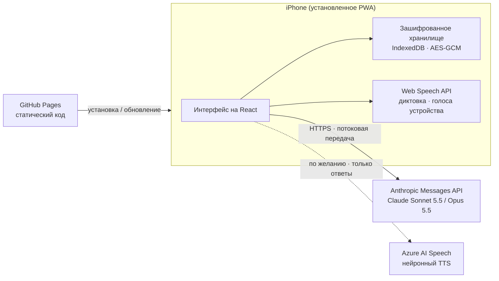

<div align="center">


# Seans

**Личный помощник для рефлексивных консультационных сессий с поддержкой ИИ, реализованный как устанавливаемое веб-приложение (PWA).**

[English](README.md) · [Türkçe](README.tr.md) · **Русский**


</div>

> [!IMPORTANT]
> Seans **не является** медицинским изделием и **не заменяет** лицензированного психотерапевта или психолога. Это личный инструмент поддержки между сессиями. В кризисной или опасной ситуации немедленно звоните по местному номеру экстренных служб (112 в Европе и Турции).

## Что это

Seans — личное мобильное приложение для структурированной рефлексии с опорой на доказательные подходы. Оно ведёт ограниченный по времени разговор в формате консультации с моделью Claude от Anthropic, хранит дневник трудных моментов и поддерживает карту клиента, которая обновляется отчётами после каждой сессии. Приложение рассчитано на **одного человека и одно устройство**: у него нет сервера, системы учётных записей и общей базы данных.

Проект начался как попытка превратить серию рефлексивных сессий в чате в спокойный, ориентированный на телефон опыт, который сохраняет преемственность между сессиями и при этом держит чувствительные данные на устройстве.

## Возможности

| Раздел | Что делает |
|---|---|
| **Сессии** | Беседы по 50 минут. Таймер идёт только пока экран открыт. Консультант опирается на карту клиента, последний отчёт и свежие записи дневника и распределяет темп по оставшемуся времени. |
| **Работа после сессии** | После завершения модель готовит черновики отчёта, обновлённой карты клиента и схемы повторяющегося паттерна («цикла»). Ничего не сохраняется, пока пользователь не прочитает, при желании не отредактирует и не подтвердит. |
| **Дневник** | Структурированные записи о трудных моментах: событие, мысль, эмоции, интенсивность (0-10), поведение и то, что было глубже. Записи передаются в следующую сессию. |
| **Карта цикла** | Повторяющийся паттерн шаг за шагом, с более здоровой альтернативой на каждом шаге. |
| **Инструменты** | Дыхание 4-7-8 с анимированной подсказкой, трёхшаговая пауза самосострадания (по Кристин Нефф) и упражнение «что под гневом». |
| **Голос** | Диктовка через системную клавиатуру или встроенное распознавание речи, озвучивание ответов голосами устройства или, по желанию, нейронными голосами Azure, режим «без рук». |
| **Безопасность** | Постоянно доступная кнопка экстренной помощи, кризисные инструкции в промпте консультанта и ясное описание границ инструмента. |
| **Языки** | Турецкий и английский — и для интерфейса, и для консультанта. |
| **Прозрачность затрат** | Для каждой сессии учитывается расход токенов и показывается примерная стоимость. |

## Конфиденциальность и безопасность

- **Данные на устройстве.** Все данные хранятся в IndexedDB браузера на устройстве. Опубликованный сайт содержит только код приложения, без личных данных.
- **Шифрование хранилища.** Всё хранилище шифруется AES-GCM (256 бит). Ключ выводится из 6-значного PIN-кода через PBKDF2-SHA-256 с 600 000 итераций, со случайной солью и новым 12-байтовым IV при каждой записи. Повторные неверные PIN-коды включают нарастающую блокировку, а через две минуты в фоне приложение блокируется само.
- **Только прямые соединения.** Во время сессии сообщения уходят с устройства напрямую в Anthropic API. Если включены голоса Azure, в Microsoft для синтеза речи отправляются только ответы консультанта. Промежуточного сервера нет.
- **Собственные ключи.** API-ключи вводятся на устройстве, хранятся в зашифрованном хранилище и не попадают в резервные копии.
- **Без восстановления.** Без PIN-кода данные расшифровать нельзя. Пользователь может экспортировать резервные копии в JSON и копии в Markdown; эти файлы не зашифрованы и требуют бережного хранения.

> [!NOTE]
> 6-значный PIN защищает от случайного доступа к устройству. Он не рассчитан на целенаправленную офлайн-атаку на извлечённую копию данных.

## Архитектура



**Ход сессии.** В начале сессии системный промпт собирается из фиксированных правил консультирования, карты клиента, последнего отчёта и свежих записей дневника и остаётся неизменным до конца сессии. Каждое сообщение пользователя несёт оставшееся время, а история диалога повторно отправляется побайтово без изменений, чтобы кэширование промптов удерживало стоимость длинных сессий на низком уровне. После завершения отдельный запрос возвращает отчёт, обновлённую карту клиента и цикл в размеченных разделах, которые приложение разбирает и показывает на проверку.

## Технологии

| Слой | Технология | Версия |
|---|---|---|
| Интерфейс | React | 19.3 |
| Язык | TypeScript | 6.0 |
| Сборка | Vite | 8.3 |
| Стили | Tailwind CSS (плагин Vite) | 4.3 |
| Анимация | Motion (`motion/react`) | 14.0 |
| Иконки | Phosphor Icons | 2.1 |
| Шрифт | Geist Variable (локально через Fontsource) | 5.3 |
| PWA | vite-plugin-pwa (Workbox) | 2.0 |
| ИИ | Anthropic TypeScript SDK (`@anthropic-ai/sdk`) | 0.131 |
| Хранилище | idb-keyval (IndexedDB) | 6.3 |
| Шифрование | Web Crypto API (PBKDF2, AES-GCM) | Встроено в браузер |
| Markdown | marked + DOMPurify | 18.0 / 3.4 |
| Речь | Web Speech API, Azure AI Speech REST (по желанию) | Встроено в браузер / v1 |
| Линтер | oxlint | 1.86 |
| Среда сборки | Node.js | 24 |
| Хостинг | GitHub Pages через GitHub Actions | |

**Настройка ИИ.** По умолчанию используется Claude Sonnet 5.5, доступен выбор Claude Opus 5.5. Запросы идут потоком, используют адаптивное мышление со средним уровнем усилий, автоматическое кэширование промптов и серверный резервный переход при отказе модели (refusal fallback).

## Структура проекта

```
src/
├── App.tsx               Оболочка приложения, блокировка и онбординг, стек навигации
├── components/           Базовые элементы UI, PIN-клавиатура, панель вкладок, экстренная помощь, микрофон
├── screens/              Главная, сессии, чат, проверка, дневник, файлы, инструменты, настройки
│   └── sessionLogic.ts   Жизненный цикл сессии: старт, отправка, завершение, отчёт, подтверждение
└── lib/
    ├── claude.ts         Клиент Anthropic, потоковая передача, учёт стоимости, обработка ошибок
    ├── prompts.ts        Правила консультанта и инструкции к отчёту (TR / EN)
    ├── crypto.ts         Вывод ключа PBKDF2 и шифрование AES-GCM
    ├── store.ts          Зашифрованное хранилище, автосохранение, блокировка попыток
    ├── i18n.ts           Типизированный словарь для турецкого и английского
    ├── speech.ts         Диктовка со сторожевым таймером, голоса устройства
    ├── voice.ts          Движок озвучивания (устройство / Azure) с запасным вариантом
    └── files.ts          Импорт / экспорт Markdown, резервные копии
```

## Быстрый старт

Требуется Node.js 24 или новее.

```bash
npm install
npm run dev      # сервер разработки
npm run build    # проверка типов и production-сборка в dist/
```

Web Crypto работает только в защищённом контексте, поэтому тестируйте на `localhost` или по HTTPS. Для работы приложения нужен собственный [ключ Anthropic API](https://console.anthropic.com). Голоса Azure не обязательны; для них нужны ключ и регион ресурса Azure AI Speech.

## Развёртывание

Каждый push в ветку `main` собирает приложение и публикует его на GitHub Pages через `.github/workflows/deploy.yml`. Сборка использует `BASE=/<имя-репозитория>/`, чтобы ресурсы находились по подпути Pages. На iPhone откройте сайт в Safari и выберите **Поделиться > На экран «Домой»**. Обновления подхватываются автоматически при следующем запуске.

## Ограничения

- Встроенное распознавание речи Safari ненадёжно в режиме приложения на экране «Домой» iPhone, поэтому там по умолчанию используется диктовка с клавиатуры.
- Данные привязаны к одному профилю браузера на одном устройстве. Удаление приложения с экрана «Домой» удаляет и его данные, поэтому важно регулярно делать резервные копии.
- Ответы модели могут содержать ошибки. Отчёты — это черновики для проверки пользователем, а не клинические документы.

## Лицензия

Лицензия пока не указана. До её добавления все права принадлежат автору.
