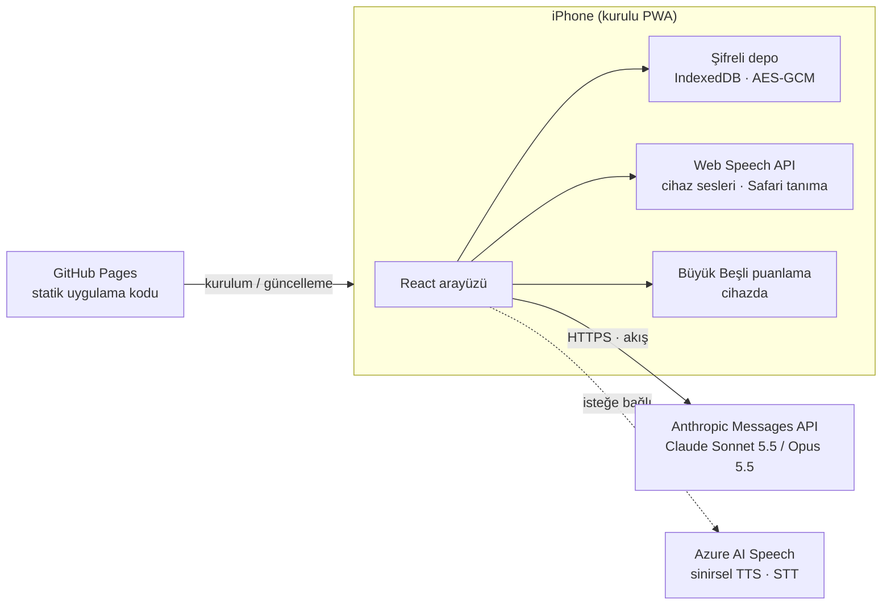

<div align="center">


# İçgörü

**Kurulabilir bir web uygulaması (PWA) olarak geliştirilmiş, yapay zeka destekli ve kişisel danışmanlık seansı arkadaşı.**

[English](README.md) · **Türkçe** · [Русский](README.ru.md)


</div>

> [!IMPORTANT]
> İçgörü bir tıbbi cihaz **değildir** ve lisanslı bir terapistin ya da psikoloğun yerini **tutmaz**. Seanslar arasında kullanılan kişisel bir destek aracıdır. Kriz ya da tehlike anında hemen 112'yi veya bulunduğun yerin acil numarasını ara.

## Nedir?

İçgörü, yapılandırılmış ve kanıta dayalı öz-değerlendirme için geliştirilmiş kişisel bir mobil uygulamadır. Anthropic'in Claude modeliyle süreyle sınırlı, danışmanlık tarzında bir görüşme yürütür. Yapay zeka danışmanın her kişiye göre uyarladığı, araştırmayla desteklenen bir araç kütüphanesi sunar. Bir günlük tutar ve her seanstan sonra raporlarla güncellenen bir danışan dosyası oluşturur. **Tek kişi ve tek cihaz** için tasarlanmıştır: sunucusu, hesap sistemi ya da ortak bir veritabanı yoktur.

Proje, sohbet üzerinden yürütülen bir dizi öz-değerlendirme seansını telefona uygun, sakin bir deneyime dönüştürme denemesi olarak başladı. Amaç, seanslar arasındaki sürekliliği korurken hassas verileri cihazda tutmaktır.

## 2.0 sürümündeki yenilikler

> Her güncelleme, neyin neden değiştiğiyle birlikte [CHANGELOG.md](CHANGELOG.md) dosyasında listelenir.

2.0 sürümü, gerçek bir kullanıcının bir seanstan sonra verdiği geri bildirimden ve uygulamayı tek bir senaryoya değil herkese hitap eder hale getirme hedefinden doğdu.

**Danışman, danışmanlıkta daha iyi oldu.** Geri bildirim dört sorunu adlandırdı. Her biri için artık danışmanın talimatlarında bir kural var:

| Geri bildirim | Değişiklik |
|---|---|
| Fazla onaylıyor, yönlendirmek yerine danışanın peşinden gidiyordu. | Danışman her seans için bir odak belirliyor, onaylamayla nazik sorgulamayı dengeliyor ve istendiğinde yönetimi üstleniyor. |
| Pratik bir konu seansın bir bölümünü kaplamıştı. | Duygusal bir noktadan teknik ya da entelektüel konulara kaymak olası bir kaçınma olarak ele alınıyor: danışman bunu erken fark edip adını koyuyor ve odağa dönüyor. |
| Evet/hayır diye tepki veriyor ve hipotezini çok çabuk değiştiriyordu. | Hipotezler gerekçeleriyle tutuluyor, yalnızca kanıtla güncelleniyor ve her değişiklik açıklanıyor. Evet/hayır yerine açık uçlu sorular tercih ediliyor. |
| Dikte hataları söylenenlerin anlamını değiştiriyordu. | Danışmana girdinin dikteden gelebileceği söyleniyor. Yanlış duyulmuş bir kelimenin üzerine yorum kurmak yerine soruyor. Çok daha doğru yazıya dökme için isteğe bağlı Azure konuşma tanıma eklendi. |

**Bir kişinin araçlarından herkesin araçlarına.** 1. sürümde egzersizler bir kişinin durumuna göre adlandırılmıştı. 2.0'da bunlar evrensel, araştırmayla desteklenen kalıplar oldu: düşünce kaydı, birincil ve ikincil duygular, öz-şefkat, ritimli nefes, topraklanma, bilişsel yeniden yapılandırma, değerler, kendini ifade etme ve dürtü sörfü. Hangi araçların öne çıkacağına, adlarının ne olacağına ve hangi seçenekleri göstereceklerine **kullanıcı değil, yapay zeka danışman karar veriyor**. Böylece aynı kalıp birisi için "Patlama öncesi an", bir başkası için "Kaygı anı" oluyor. Danışman yalnızca doğrulanmış parametreler arasından seçim yapabiliyor, yeni ekran icat edemiyor. Her değişiklik seans onay ekranında onaya sunuluyor.

**Yeni kullanıcılar için kişilik testi.** Danışan dosyası olmadan başlayanlar, kısa bir Büyük Beşli testini (20 soruluk, kamu malı Mini-IPIP) sade, kart tabanlı bir arayüzle yapabiliyor. Puanlama cihazda yapılıyor. Sonuç ve "seni buraya ne getirdi" seçimleri sayesinde danışman tek bir istekle ilk danışan dosyasını ve araçları hazırlıyor.

**Tasarımdan gelen düşük maliyet.** Araç güncellemeleri seans sonundaki rapor isteğine ekleniyor, bu yüzden neredeyse hiç ek maliyet getirmiyor. Yeni bir kullanıcıyı kişiselleştirmek birkaç sentlik tek bir istek. Test puanlaması cihazda yapılıyor.

**Yeni isim.** Uygulama artık yalnızca bir seans ekranından ibaret olmadığı için adı "Seans"tan **İçgörü** olarak değişti.

## Özellikler

| Alan | Ne yapar |
|---|---|
| **Seanslar** | 50 dakikalık görüşmeler. Süre yalnızca ekran açıkken işler. Danışman; danışan dosyası, son rapor, günlük ve araç kayıtları ile kişilik profili üzerinden çalışır ve temposunu kalan süreye göre ayarlar. |
| **Seans sonrası** | Seans kapanınca model rapor, güncellenmiş danışan dosyası, tekrar eden örüntünün ("döngü") haritası ve varsa araç değişikliklerini taslak olarak hazırlar. Kullanıcı okuyup isterse düzeltmeden ve onaylamadan hiçbir şey kaydedilmez. |
| **Araç kütüphanesi** | Kanıta dayalı dokuz araç. Danışman en fazla beşini ana ekranda öne çıkarır, danışanın kendi diliyle adlandırır ve her birinin neden uygun olduğunu açıklar. |
| **Kişilik testi** | Adlandırılmış bir sonuç kartı ve özellik açıklamalarıyla Mini-IPIP Büyük Beşli. İsteğe bağlı, tekrarlanabilir, puanlaması cihazda. |
| **Günlük** | Yapılandırılmış an kayıtları ve kaydedilen araç sonuçları (düşünce kontrolleri, konuşma hazırlıkları, değerler, dürtüler). Kayıtlar bir sonraki seansa aktarılır. |
| **Ses** | Üç konuşma tanıma seçeneği (klavye, Safari, Azure), cihaz sesleri ya da Azure sinirsel sesleriyle sesli okuma ve eller serbest modu. |
| **Güvenlik** | Her zaman görünen bir acil yardım düğmesi, danışman talimatlarında kriz yönergeleri ve aracın sınırlarının açıkça belirtilmesi. |
| **Diller** | Hem arayüz hem danışman için Türkçe ve İngilizce. |
| **Maliyet şeffaflığı** | Her seansın token kullanımı ve tahmini maliyeti izlenir ve gösterilir. |

### Araç kalıpları

| Kalıp | Dayandığı yöntem | Danışmanın ayarlayabildikleri |
|---|---|---|
| An kaydı | BDT düşünce kaydı | Ad, duygu listesi, altta yatan duyguya dair soru |
| Duygunun altında | Birincil ve ikincil duygular (EFT) | Yüzeydeki duygu, altta yatan duygular listesi |
| Öz-şefkat molası | Neff'in üç adımı | İç eleştirmene karşı nazik bir cümle |
| Nefes | Ritimli nefes | 4-7-8, kutu nefesi, fizyolojik iç çekiş ya da dengeli nefes |
| Topraklanma | 5-4-3-2-1 duyular | Ad |
| Düşünce kontrolü | Bilişsel yeniden yapılandırma | Ad |
| Değer pusulası | Kabul ve Kararlılık Terapisi | Danışana uygun değerler |
| Kendini ifade et | DBT DEAR MAN | Ad |
| Dürtü sörfü | Bilinçli farkındalık temelli nüks önleme | Dürtünün ne olduğu, süre |

## Gizlilik ve güvenlik

- **Önce cihaz.** Tüm veriler cihazdaki tarayıcının IndexedDB deposunda tutulur. Yayınlanan sitede yalnızca uygulama kodu bulunur, kişisel veri bulunmaz.
- **Şifreli depolama.** Tüm veri deposu AES-GCM (256 bit) ile şifrelenir. Anahtar, 6 haneli PIN'den PBKDF2-SHA-256 ile 600.000 yinelemeyle türetilir. Rastgele bir tuz (salt) kullanılır ve her yazmada yeni bir 12 baytlık IV üretilir. Art arda yanlış girilen PIN'ler giderek uzayan bir bekleme süresi başlatır. Uygulama arka planda iki dakika kalınca kendini kilitler.
- **Yalnızca doğrudan bağlantı.** Seans sırasında mesajlar cihazdan doğrudan Anthropic API'ye gider. Arada bir sunucu yoktur.
- **Microsoft'a yalnızca seçilirse.** Sesli okumada Azure seçilirse danışmanın cevapları, konuşma tanımada Azure seçilirse kullanıcının sesi Microsoft'a gönderilir. Diğer seçeneklerde Microsoft'a hiçbir şey gitmez.
- **Kendi anahtarın.** API anahtarları cihazda girilir, şifreli depoda tutulur ve yedeklere dahil edilmez.
- **Kurtarma yok.** PIN olmadan veriler çözülemez. Kullanıcı JSON yedekleri ve Markdown kopyaları alabilir. Bu dosyalar şifreli değildir ve özenle saklanmalıdır.

> [!NOTE]
> 6 haneli PIN, cihaza gelişigüzel erişime karşı koruma sağlar. Verinin kopyalanıp çevrimdışı olarak kararlı bir saldırıya maruz kalması durumuna karşı tasarlanmamıştır.

## Mimari



**Seans akışı.** Seans başında; sabit danışmanlık kuralları, danışan dosyası, son rapor, son günlük ve araç kayıtları, danışanın araçları ve kişilik profilinden bir sistem talimatı oluşturulur ve seans boyunca değişmez. Her kullanıcı mesajı kalan süreyi taşır. Konuşma geçmişi bayt bayt aynı şekilde yeniden gönderilir, böylece istem önbelleği (prompt caching) uzun seansların maliyetini düşük tutar. Seans kapanınca ayrı bir istek; raporu, güncellenmiş danışan dosyasını, döngüyü ve araç değişikliklerini etiketli bölümler halinde döndürür. Uygulama bunları ayrıştırır, doğrular ve onaya sunar.

**Araç kişiselleştirmesi nasıl güvenli kalıyor?** Danışman küçük bir JSON değişiklik paketiyle cevap verir. Uygulama yalnızca bilinen araç türlerini ve parametreleri kabul eder, metin uzunluklarını ve liste boyutlarını sınırlar, paketi mevcut ayarların üzerine birleştirir ve eksik ya da geçersiz her şey için yerleşik varsayılanlara döner. "Değişiklik yok" tek bir kelimedir, bu yüzden değişiklik olmayan seanslar ek maliyet getirmez.

## Teknoloji yığını

| Katman | Teknoloji | Sürüm |
|---|---|---|
| Arayüz | React | 19.3 |
| Dil | TypeScript | 6.0 |
| Derleme | Vite | 8.3 |
| Stil | Tailwind CSS (Vite eklentisi) | 4.3 |
| Animasyon | Motion (`motion/react`) | 14.0 |
| İkonlar | Phosphor Icons | 2.1 |
| Yazı tipi | Geist Variable (Fontsource ile yerel) | 5.3 |
| PWA | vite-plugin-pwa (Workbox) | 2.0 |
| Yapay zeka | Anthropic TypeScript SDK (`@anthropic-ai/sdk`) | 0.131 |
| Depolama | idb-keyval (IndexedDB) | 6.3 |
| Şifreleme | Web Crypto API (PBKDF2, AES-GCM) | Tarayıcıda yerleşik |
| Markdown | marked + DOMPurify | 18.0 / 3.4 |
| Ses | Web Speech API; TTS ve kısa ses STT için Azure AI Speech REST (isteğe bağlı) | Tarayıcıda yerleşik / v1 |
| Ses kaydı | getUserMedia + Web Audio, 16 kHz PCM WAV kodlama | Tarayıcıda yerleşik |
| Kişilik | Mini-IPIP, 20 madde (Donnellan ve ark., 2006), IPIP kamu malı | |
| Lint | oxlint | 1.86 |
| Derleme ortamı | Node.js | 24 |
| Barındırma | GitHub Actions ile GitHub Pages | |

**Yapay zeka yapılandırması.** Varsayılan model Claude Sonnet 5.5'tir, Claude Opus 5.5 seçilebilir. İstekler akış (streaming) ile gelir, orta düzeyde uyarlanabilir düşünme (adaptive thinking) kullanır, otomatik istem önbelleğini açar ve sunucu tarafı ret yedeklemesini (refusal fallback) etkinleştirir.

## Proje yapısı

```
src/
├── App.tsx               Uygulama kabuğu, kilit ve kurulum geçişleri, gezinme yığını
├── components/           Temel arayüz parçaları, PIN tuş takımı, sekme çubuğu, acil yardım, mikrofon, yazı alanı
├── screens/
│   ├── Home.tsx          Danışmanın öne çıkardığı araçlardan oluşan ana ekran
│   ├── Tools.tsx         Araç kütüphanesi ve dokuz araç ekranı
│   ├── Personality.tsx   Büyük Beşli testi, başvuru nedenleri, sonuç kartı
│   ├── SessionChat.tsx   Sesli giriş ve sesli okumalı seans ekranı
│   ├── Review.tsx        Onay için rapor, danışan dosyası, döngü ve araç değişiklikleri
│   └── sessionLogic.ts   Seans yaşam döngüsü, raporlar, kişiselleştirme
└── lib/
    ├── claude.ts         Anthropic istemcisi, akış, maliyet hesabı, hata eşleme
    ├── prompts.ts        Danışman kuralları, rapor ve kişiselleştirme talimatları (TR / EN)
    ├── tools.ts          Araç kalıpları, varsayılanlar, danışman paketlerinin doğrulanması ve birleştirilmesi
    ├── personality.ts    Mini-IPIP maddeleri, puanlama, profil adları, özellik metinleri
    ├── crypto.ts         PBKDF2 anahtar türetme ve AES-GCM şifreleme
    ├── store.ts          Şifreli kasa, otomatik kayıt, deneme kilidi
    ├── i18n.ts           Türkçe ve İngilizce için tipli sözlük
    ├── dictation.ts      Ayarlara göre konuşma tanıma motorunu seçer
    ├── speech.ts         Gözetimli Safari konuşma tanıma, cihaz sesleri
    ├── stt.ts            Azure konuşma tanıma: kayıt, WAV kodlama, parçalama
    ├── voice.ts          Sesli okuma motoru (cihaz / Azure) ve yedek yol
    └── files.ts          Markdown içe / dışa aktarma, yedekler
```

## Başlangıç

Gereksinim: Node.js 24 veya üstü.

```bash
npm install
npm run dev      # geliştirme sunucusu
npm run build    # tip denetimi ve dist/ klasörüne üretim derlemesi
```

Web Crypto güvenli bir bağlam gerektirir. Bu yüzden testleri `localhost` üzerinde ya da HTTPS ile yap. Uygulamayı kullanmak için kendi [Anthropic API anahtarın](https://console.anthropic.com) gerekir. Azure sesleri ve Azure konuşma tanıma isteğe bağlıdır ve bir Azure AI Speech kaynağının anahtarını ve bölgesini ister.

## Yayınlama

`main` dalına yapılan her gönderim, `.github/workflows/deploy.yml` üzerinden uygulamayı derler ve GitHub Pages'e yayınlar. Derleme, dosyaların Pages alt yolunda doğru bulunması için `BASE=/<depo-adı>/` değerini okur. iPhone'da siteyi Safari ile aç ve **Paylaş > Ana Ekrana Ekle** seçeneğini kullan. Güncellemeler, uygulama bir sonraki açılışta kendiliğinden yüklenir.

## Sınırlamalar

- Safari'nin uygulama içi konuşma tanıması iPhone ana ekran modunda güvenilir değildir, bu yüzden orada varsayılan yol klavye diktesidir. Azure konuşma tanıma bu modda da çalışır.
- Kişilik testinin Türkçe ifadeleri projenin kendi çevirisidir, resmi olarak doğrulanmış bir uyarlama değildir. Test klinik bir değerlendirme değil, hafif bir ipucu verir.
- Veriler tek bir cihazdaki tek bir tarayıcı profiline bağlıdır. Ana ekrandaki uygulamayı silmek verilerini de siler, bu yüzden düzenli yedek almak önemlidir.
- Model çıktıları hatalı olabilir. Raporlar ve araç önerileri kullanıcının gözden geçirmesi gereken taslaklardır, klinik belge değildir.

## Yardımcı uygulamalar

| Uygulama | Ne yapar |
|---|---|
| [**Akşam Notu**](https://github.com/YILDIRIMZX/aksam-notu) | Küçük bir akşam notu: yatmadan önce isteğe bağlı üç satır (açıkta kalan problem, yarın atacağım ilk adım, bugün alarm çaldı mı). Bilgisayar gece kapanınca ya da en geç 22:00'de telefona günde bir kez hatırlatma gelir. Ayrı repo, aynı görünüm. |

## Lisans

[MIT Lisansı](LICENSE) ile yayınlanmıştır. Telif hakkı (c) 2026 Yıldırım Öztürk.

Yazılım "olduğu gibi", hiçbir garanti olmaksızın sunulur. Tıbbi bir cihaz değildir. Onu yayınlayan ya da uyarlayan kişi, nasıl kullanıldığından kendisi sorumludur.
