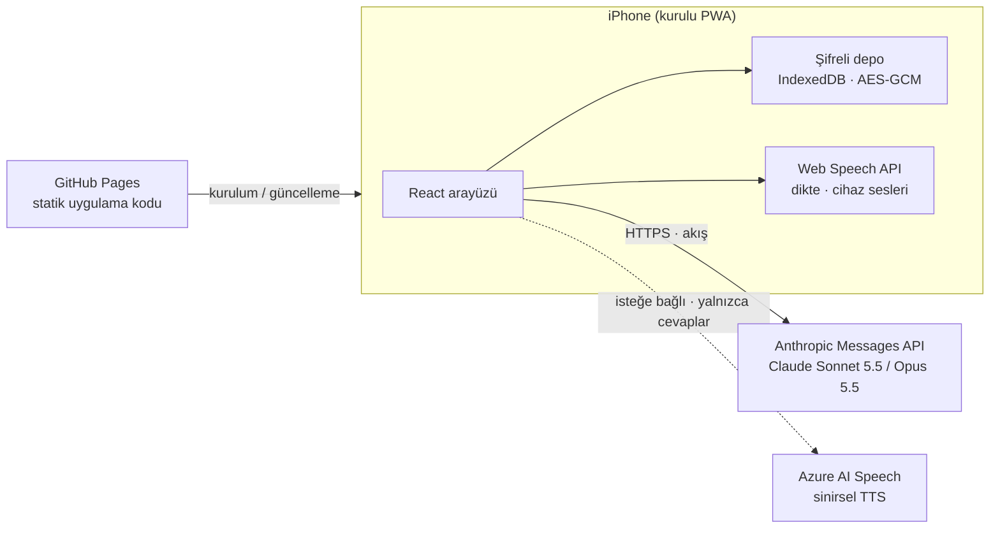

<div align="center">


# Seans

**Kurulabilir bir web uygulaması (PWA) olarak geliştirilmiş, yapay zeka destekli ve kişisel danışmanlık seansı arkadaşı.**

[English](README.md) · **Türkçe** · [Русский](README.ru.md)


</div>

> [!IMPORTANT]
> Seans bir tıbbi cihaz **değildir** ve lisanslı bir terapistin ya da psikoloğun yerini **tutmaz**. Seanslar arasında kullanılan kişisel bir destek aracıdır. Kriz ya da tehlike anında hemen 112'yi veya bulunduğun yerin acil numarasını ara.

## Nedir?

Seans, yapılandırılmış ve kanıta dayalı öz-değerlendirme için geliştirilmiş kişisel bir mobil uygulamadır. Anthropic'in Claude modeliyle süreyle sınırlı, danışmanlık tarzında bir görüşme yürütür. Zor anlar için bir günlük tutar ve her seanstan sonra raporlarla güncellenen bir danışan dosyası oluşturur. **Tek kişi ve tek cihaz** için tasarlanmıştır: sunucusu, hesap sistemi ya da ortak bir veritabanı yoktur.

Proje, sohbet üzerinden yürütülen bir dizi öz-değerlendirme seansını telefona uygun, sakin bir deneyime dönüştürme denemesi olarak başladı. Amaç, seanslar arasındaki sürekliliği korurken hassas verileri cihazda tutmaktır.

## Özellikler

| Alan | Ne yapar |
|---|---|
| **Seanslar** | 50 dakikalık görüşmeler. Süre yalnızca ekran açıkken işler. Danışman; danışan dosyası, son rapor ve son günlük kayıtları üzerinden çalışır ve temposunu kalan süreye göre ayarlar. |
| **Seans sonrası** | Seans kapanınca model bir seans raporu, güncellenmiş danışan dosyası ve tekrar eden örüntünün ("döngü") haritasını taslak olarak hazırlar. Kullanıcı okuyup isterse düzeltmeden ve onaylamadan hiçbir şey kaydedilmez. |
| **Günlük** | Zor anlar için yapılandırılmış kayıt: olay, düşünce, duygular, yoğunluk (0-10), davranış ve altında yatan duygu. Kayıtlar bir sonraki seansa aktarılır. |
| **Döngü haritası** | Tekrar eden örüntü adım adım gösterilir. Her adımda daha sağlıklı bir alternatif önerilir. |
| **Araçlar** | Animasyonlu 4-7-8 nefes egzersizi, üç adımlı öz-şefkat molası (Kristin Neff'ten uyarlanmıştır) ve "öfkenin altında" egzersizi. |
| **Ses** | Klavye diktesi ya da uygulama içi konuşma tanıma, cihaz sesleriyle veya isteğe bağlı Azure sinirsel sesleriyle sesli okuma ve eller serbest modu. |
| **Güvenlik** | Her zaman görünen bir acil yardım düğmesi, danışman talimatlarında kriz yönergeleri ve aracın sınırlarının açıkça belirtilmesi. |
| **Diller** | Hem arayüz hem danışman için Türkçe ve İngilizce. |
| **Maliyet şeffaflığı** | Her seansın token kullanımı ve tahmini maliyeti izlenir ve gösterilir. |

## Gizlilik ve güvenlik

- **Önce cihaz.** Tüm veriler cihazdaki tarayıcının IndexedDB deposunda tutulur. Yayınlanan sitede yalnızca uygulama kodu bulunur, kişisel veri bulunmaz.
- **Şifreli depolama.** Tüm veri deposu AES-GCM (256 bit) ile şifrelenir. Anahtar, 6 haneli PIN'den PBKDF2-SHA-256 ile 600.000 yinelemeyle türetilir. Rastgele bir tuz (salt) kullanılır ve her yazmada yeni bir 12 baytlık IV üretilir. Art arda yanlış girilen PIN'ler giderek uzayan bir bekleme süresi başlatır. Uygulama arka planda iki dakika kalınca kendini kilitler.
- **Yalnızca doğrudan bağlantı.** Seans sırasında mesajlar cihazdan doğrudan Anthropic API'ye gider. Azure sesleri açıksa yalnızca danışmanın cevapları seslendirilmek üzere Microsoft'a gönderilir. Arada bir sunucu yoktur.
- **Kendi anahtarın.** API anahtarları cihazda girilir, şifreli depoda tutulur ve yedeklere dahil edilmez.
- **Kurtarma yok.** PIN olmadan veriler çözülemez. Kullanıcı JSON yedekleri ve Markdown kopyaları alabilir. Bu dosyalar şifreli değildir ve özenle saklanmalıdır.

> [!NOTE]
> 6 haneli PIN, cihaza gelişigüzel erişime karşı koruma sağlar. Verinin kopyalanıp çevrimdışı olarak kararlı bir saldırıya maruz kalması durumuna karşı tasarlanmamıştır.

## Mimari



**Seans akışı.** Seans başında; sabit danışmanlık kuralları, danışan dosyası, son rapor ve son günlük kayıtlarından bir sistem talimatı oluşturulur ve seans boyunca değişmez. Her kullanıcı mesajı kalan süreyi taşır. Konuşma geçmişi bayt bayt aynı şekilde yeniden gönderilir, böylece istem önbelleği (prompt caching) uzun seansların maliyetini düşük tutar. Seans kapanınca ayrı bir istek; raporu, güncellenmiş danışan dosyasını ve döngüyü etiketli bölümler halinde döndürür. Uygulama bunları ayrıştırıp onaya sunar.

## Teknoloji yığını

| Katman | Teknoloji | Sürüm |
|---|---|---|
| Arayüz | React | 19.3 |
| Dil | TypeScript | 6.0 |
| Derleme | Vite | 8.3 |
| Stil | Tailwind CSS (Vite eklentisi) | 4.3 |
| Animasyon | Motion (`motion/react`) | 14.0 |
| İkonlar | Phosphor Icons | 2.1 |
| Yazı tipi | Geist Variable (Fontsource ile yerel) | 5.3 |
| PWA | vite-plugin-pwa (Workbox) | 2.0 |
| Yapay zeka | Anthropic TypeScript SDK (`@anthropic-ai/sdk`) | 0.131 |
| Depolama | idb-keyval (IndexedDB) | 6.3 |
| Şifreleme | Web Crypto API (PBKDF2, AES-GCM) | Tarayıcıda yerleşik |
| Markdown | marked + DOMPurify | 18.0 / 3.4 |
| Ses | Web Speech API, Azure AI Speech REST (isteğe bağlı) | Tarayıcıda yerleşik / v1 |
| Lint | oxlint | 1.86 |
| Derleme ortamı | Node.js | 24 |
| Barındırma | GitHub Actions ile GitHub Pages | |

**Yapay zeka yapılandırması.** Varsayılan model Claude Sonnet 5.5'tir, Claude Opus 5.5 seçilebilir. İstekler akış (streaming) ile gelir, orta düzeyde uyarlanabilir düşünme (adaptive thinking) kullanır, otomatik istem önbelleğini açar ve sunucu tarafı ret yedeklemesini (refusal fallback) etkinleştirir.

## Proje yapısı

```
src/
├── App.tsx               Uygulama kabuğu, kilit ve kurulum geçişleri, gezinme yığını
├── components/           Temel arayüz parçaları, PIN tuş takımı, sekme çubuğu, acil yardım, mikrofon
├── screens/              Ana sayfa, seanslar, sohbet, onay, günlük, dosyalar, araçlar, ayarlar
│   └── sessionLogic.ts   Seans yaşam döngüsü: başlatma, gönderme, kapanış, rapor, onay
└── lib/
    ├── claude.ts         Anthropic istemcisi, akış, maliyet hesabı, hata eşleme
    ├── prompts.ts        Danışman kuralları ve rapor talimatları (TR / EN)
    ├── crypto.ts         PBKDF2 anahtar türetme ve AES-GCM şifreleme
    ├── store.ts          Şifreli kasa, otomatik kayıt, deneme kilidi
    ├── i18n.ts           Türkçe ve İngilizce için tipli sözlük
    ├── speech.ts         Gözetimli dikte, cihaz sesleri
    ├── voice.ts          Sesli okuma motoru (cihaz / Azure) ve yedek yol
    └── files.ts          Markdown içe / dışa aktarma, yedekler
```

## Başlangıç

Gereksinim: Node.js 24 veya üstü.

```bash
npm install
npm run dev      # geliştirme sunucusu
npm run build    # tip denetimi ve dist/ klasörüne üretim derlemesi
```

Web Crypto güvenli bir bağlam gerektirir. Bu yüzden testleri `localhost` üzerinde ya da HTTPS ile yap. Uygulamayı kullanmak için kendi [Anthropic API anahtarın](https://console.anthropic.com) gerekir. Azure sesleri isteğe bağlıdır ve bir Azure AI Speech kaynağının anahtarını ve bölgesini ister.

## Yayınlama

`main` dalına yapılan her gönderim, `.github/workflows/deploy.yml` üzerinden uygulamayı derler ve GitHub Pages'e yayınlar. Derleme, dosyaların Pages alt yolunda doğru bulunması için `BASE=/<depo-adı>/` değerini okur. iPhone'da siteyi Safari ile aç ve **Paylaş > Ana Ekrana Ekle** seçeneğini kullan. Güncellemeler, uygulama bir sonraki açılışta kendiliğinden yüklenir.

## Sınırlamalar

- Safari'nin uygulama içi konuşma tanıması iPhone ana ekran modunda güvenilir değildir. Bu yüzden orada varsayılan yol klavye diktesidir.
- Veriler tek bir cihazdaki tek bir tarayıcı profiline bağlıdır. Ana ekrandaki uygulamayı silmek verilerini de siler, bu yüzden düzenli yedek almak önemlidir.
- Model çıktıları hatalı olabilir. Raporlar kullanıcının gözden geçirmesi gereken taslaklardır, klinik belge değildir.

## Lisans

[MIT Lisansı](LICENSE) ile yayınlanmıştır. Telif hakkı (c) 2026 Yıldırım Öztürk.

Yazılım "olduğu gibi", hiçbir garanti olmaksızın sunulur. Tıbbi bir cihaz değildir. Onu yayınlayan ya da uyarlayan kişi, nasıl kullanıldığından kendisi sorumludur.
